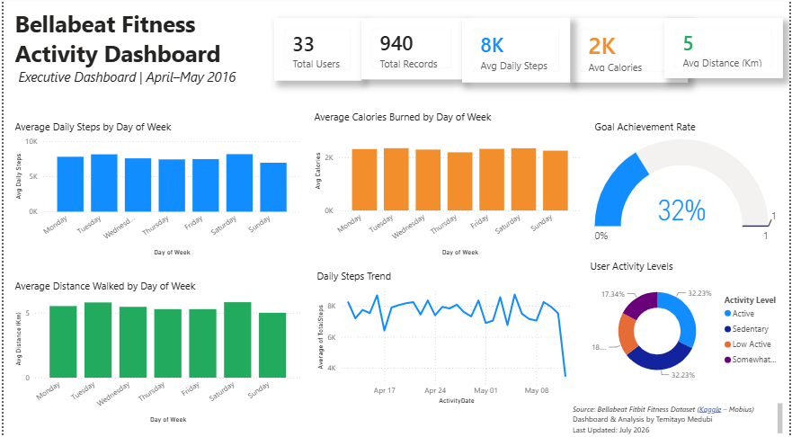

# Bellabeat Fitness Activity Dashboard

## Executive Dashboard | April–May 2016 Fitness Analysis

This project presents an executive Power BI dashboard built using the Bellabeat Fitbit Fitness Dataset. The dashboard analyzes daily fitness activities, including steps, calories burned, walking distance, goal achievement, and user activity levels to generate business insights.

---

## Business Objective

Bellabeat is a high-tech company that manufactures health-focused smart products for women. The objective of this project is to analyze user fitness behavior and provide insights that can support marketing and product strategy.

---

## Dashboard Preview

---

## Dashboard KPIs

- Total Users
- Total Activity Records
- Average Daily Steps
- Average Calories Burned
- Average Distance Walked
- Goal Achievement Rate

---

## Dashboard Visualizations

- Average Daily Steps by Day of Week
- Average Calories Burned by Day of Week
- Average Distance Walked by Day of Week
- Daily Steps Trend
- Goal Achievement Gauge
- User Activity Level Distribution

---

## Key Insights

- Saturday recorded the highest average daily steps.
- Average calories burned generally increased with higher activity levels.
- Walking distance closely followed step count trends.
- Only about 32% of users achieved the recommended daily goal of 10,000 steps.
- A significant proportion of users were classified as sedentary or low active, indicating opportunities for increased engagement.

---

## Business Recommendations

- Encourage users through personalized daily step goals.
- Launch weekend fitness campaigns to leverage higher activity levels.
- Introduce engagement programs targeting sedentary users.
- Use activity trends to send timely wellness reminders.
- Promote walking challenges to increase overall physical activity.

---

## Tools Used

- Microsoft Power BI
- SQL Server
- SQL
- Microsoft Excel
- Power Query
- DAX
- Git
- GitHub

---

## Skills Demonstrated

- Data Cleaning
- Data Transformation
- DAX Calculations
- Dashboard Design
- Data Visualization
- KPI Reporting
- Business Intelligence
- Storytelling with Data

---

## Dataset

Bellabeat Fitbit Fitness Dataset (Mobius)

Source:
https://www.kaggle.com/datasets/arashnic/fitbit

---

## Project Files

| File | Description |
|------|-------------|
| Bellabeat Executive Dashboard.pbix | Interactive Power BI Dashboard |
| dailyActivity_merged.csv | Original Fitbit dataset |
| Bellabeat_SQL_Script.sql | SQL analysis queries |
| Dashboard.png | Dashboard screenshot |

## Author

**Temitayo Medubi**

Business Intelligence Analyst | Data Analyst | Power BI Developer

GitHub:
https://github.com/Maggidub

Email:
adeleyetemitayo@gmail.com