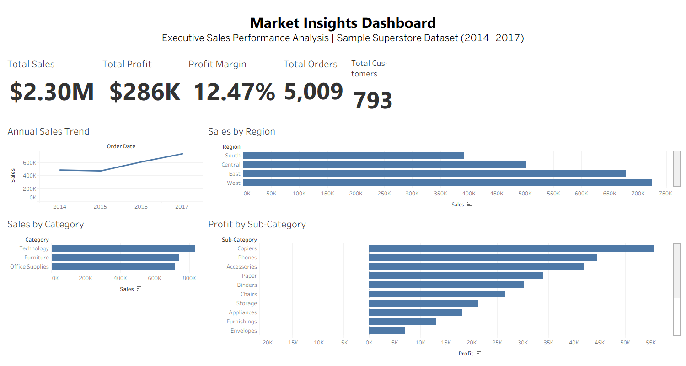

# 📈 Market Insights & Sales Analytics

## Executive Sales Performance Analysis | Sample Superstore Dataset

This project presents an end-to-end business analytics solution built using **SQL Server, Python, Power BI, and Tableau**. It demonstrates how raw retail sales data can be transformed into actionable business insights through data cleaning, validation, exploratory data analysis, executive dashboard development, and strategic recommendations.

The objective is to help business leaders understand sales performance, profitability, customer behavior, product performance, and regional trends for informed decision-making.

---

# Business Objective

The primary objective of this project is to analyze retail sales performance and answer critical business questions such as:

- Which regions generate the highest sales and profit?
- Which product categories drive revenue?
- Which sub-categories are most profitable?
- How do discounts affect profitability?
- Which customer segments contribute the most revenue?
- What opportunities exist to improve business performance?

---

# Dataset

**Dataset:** Sample Superstore

The dataset contains retail transaction records including:

- Orders
- Sales
- Profit
- Discount
- Quantity
- Customer Segment
- Region
- Category
- Sub-Category
- Shipping Mode
- Order Date

---

# Tools & Technologies

- SQL Server
- Microsoft Excel
- Python
- Jupyter Notebook
- Pandas
- Matplotlib
- Power BI
- Tableau
- Git
- GitHub

---

# Project Workflow

## 1. Data Validation (SQL)

The dataset was validated using SQL Server to ensure data quality before analysis.

Validation checks included:

- Missing values
- Duplicate records
- Invalid dates
- Data type validation
- Business rule verification

---

## 2. Business Analysis (SQL)

SQL queries were developed to answer important business questions including:

- Total Sales
- Total Profit
- Profit Margin
- Total Orders
- Customer Count
- Sales by Region
- Sales by Category
- Profit by Sub-Category
- Customer Segment Performance
- Shipping Mode Analysis

---

## 3. Exploratory Data Analysis (Python)

Python was used to explore sales patterns and visualize business performance.

Charts created include:

- Annual Sales Trend
- Sales by Region
- Sales by Segment
- Sales by Category
- Top Customers by Sales
- Top Customers by Profit
- Top Performing Sub-Categories
- Shipping Mode Distribution
- Discount vs Profit
- Correlation Matrix

---

## 4. Executive Dashboard (Power BI)

The Power BI dashboard provides executives with an interactive overview of business performance through:

- KPI Cards
- Sales Trend
- Regional Performance
- Category Analysis
- Customer Segment Analysis
- Profit Analysis
- Interactive Filters

---

## 5. Executive Dashboard (Tableau)

The Tableau dashboard was developed to provide an executive-level summary of key performance metrics.

### Dashboard Preview



Key dashboard features include:

- Total Sales
- Total Profit
- Profit Margin
- Total Orders
- Total Customers
- Annual Sales Trend
- Sales by Region
- Sales by Category
- Profit by Sub-Category

Interactive filtering allows users to explore business performance by selecting individual regions.

---

# Key Business Insights

The analysis revealed several important insights:

- The West region generated the highest sales performance.
- Technology was the highest-performing product category.
- Some sub-categories produced high revenue but relatively low profit due to discounting.
- Discounts have a measurable impact on profitability.
- Customer purchasing behavior varies significantly across market segments.
- Executive dashboards improve visibility into sales and operational performance.

---

# Business Recommendations

Based on the analysis, the following recommendations were identified:

- Optimize discount strategies to improve profit margins.
- Increase investment in high-performing regions.
- Expand high-profit product categories.
- Review low-performing sub-categories.
- Develop targeted strategies for customer segments.
- Continuously monitor KPIs using executive dashboards.

---

# Project Structure

```
03_Market_Insights_And_Sales_Analytics
│
├── Dashboard
│   ├── PowerBI
│   └── Tableau
│
├── Dataset
│
├── Images
│
├── Python
│   ├── Charts
│   └── Market_Insights_EDA.ipynb
│
├── Report
│
├── SQL
│
├── Business_Insights.md
│
└── README.md
```

---

# Skills Demonstrated

- SQL
- Data Validation
- Data Cleaning
- Exploratory Data Analysis
- Python
- Business Intelligence
- Power BI
- Tableau
- Dashboard Design
- Data Storytelling
- Executive Reporting
- Business Analytics
- Git & GitHub

---

# Author

**Temitayo Medubi**

Business Intelligence | Data Analytics | Customer Experience Analytics

- LinkedIn: www.linkedin.com/in/temitayomedubi
- GitHub: https://github.com/Maggidub